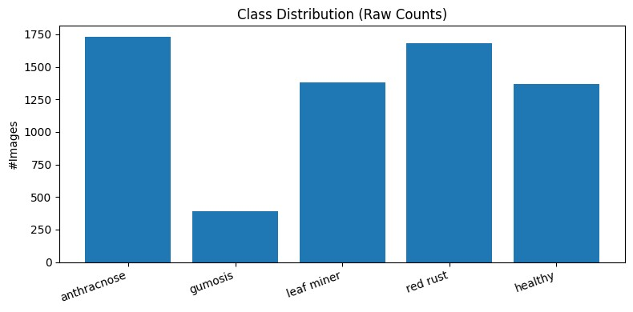
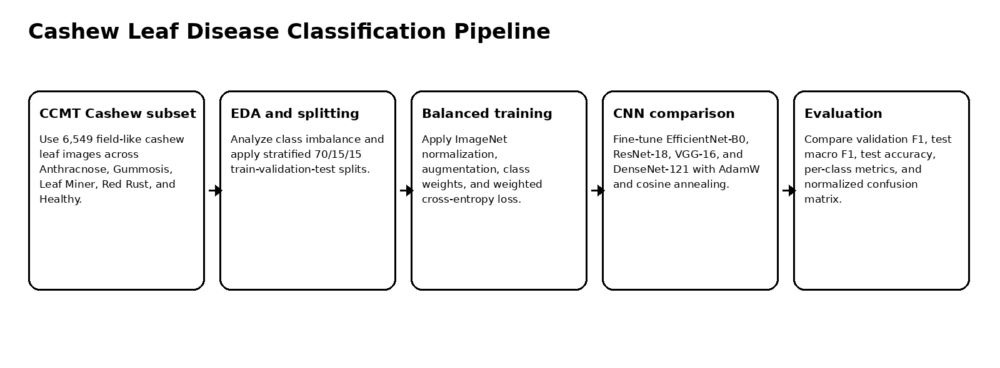
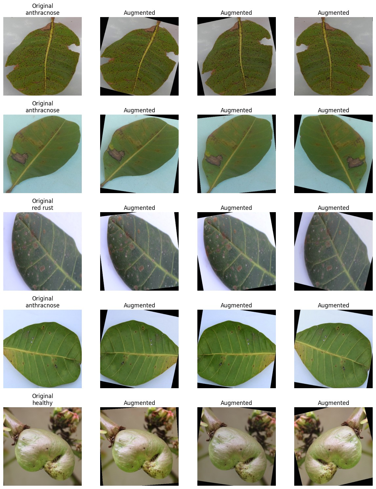
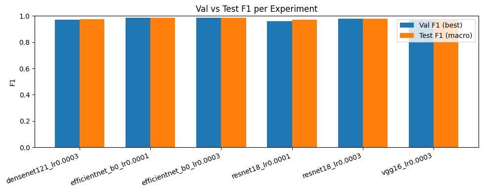
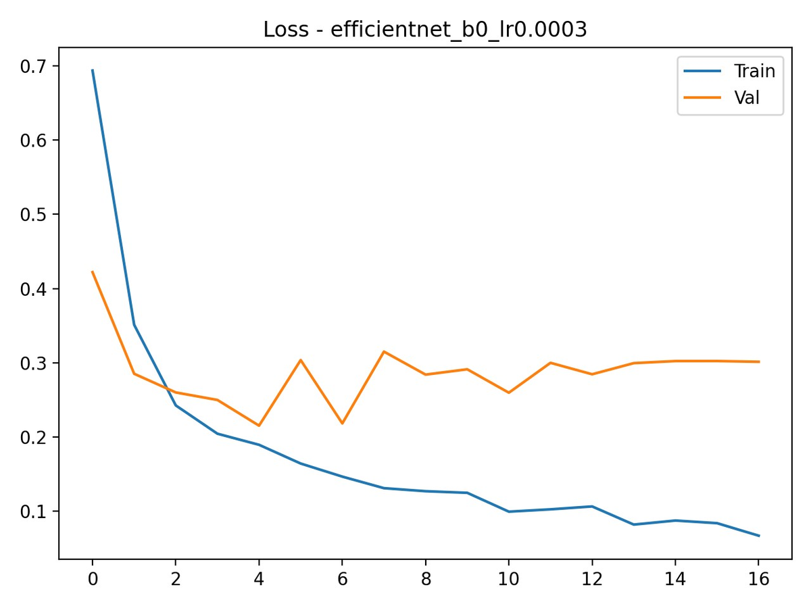
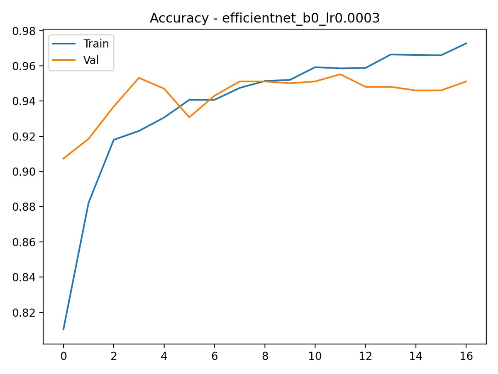
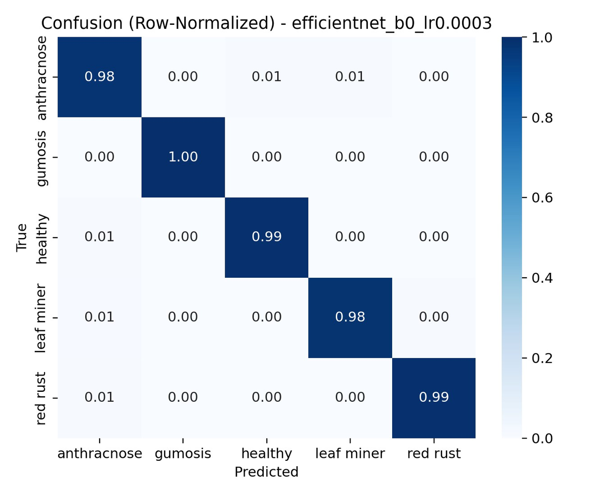

# Cashew Leaf Disease Classification

Deep-learning system for multi-class cashew leaf disease classification using transfer learning, class weighting, stratified splitting, and comparative CNN evaluation.

## Overview

This project develops a computer vision pipeline for automatically classifying cashew leaf images into five categories:

- Anthracnose
- Gummosis
- Leaf Miner
- Red Rust
- Healthy

The project uses the Cashew subset of the CCMT crop pest and disease dataset and compares four ImageNet-pretrained convolutional neural network architectures: **EfficientNet-B0**, **ResNet-18**, **VGG-16**, and **DenseNet-121**.

The best model, **EfficientNet-B0 with learning rate 3e-4**, achieved **98.58% test accuracy** and **98.80% macro F1-score**.

## Why This Project Matters

Cashew leaf disease diagnosis is usually performed manually, which can be slow, subjective, and inconsistent. A reliable image-based classifier can support faster agricultural decision-making by helping identify disease categories from leaf images.

The project is especially focused on robust training under class imbalance, because the Gummosis class is much smaller than the other categories.

## Dataset

| Item | Value |
|---|---:|
| Dataset | CCMT Cashew subset |
| Total images | 6,549 |
| Number of classes | 5 |
| Train / validation / test split | 70% / 15% / 15% |
| Input size | 224 × 224 |
| Smallest class | Gummosis |
| Largest class | Anthracnose |

## Class Distribution



The raw dataset is moderately imbalanced:

| Class | Approximate share |
|---|---:|
| Anthracnose | 26% |
| Red Rust | 25% |
| Leaf Miner | 21% |
| Healthy | 21% |
| Gummosis | 6% |

To reduce imbalance effects, the training pipeline uses stratified splitting and class-weighted cross-entropy loss.

## Training Pipeline



## Data Preparation

The preprocessing workflow includes:

- stratified train/validation/test splitting,
- resizing images to 224 × 224,
- ImageNet mean/std normalization,
- random resized crop,
- horizontal flipping,
- color jitter,
- class weighting for imbalanced learning.

## Augmentation Examples



## Model Architectures

| Model | Role |
|---|---|
| EfficientNet-B0 | Lightweight efficient CNN; best final model |
| ResNet-18 | Residual CNN baseline |
| VGG-16 | Larger classical CNN baseline |
| DenseNet-121 | Dense connectivity CNN comparison |

All models were trained with:

| Component | Configuration |
|---|---|
| Framework | PyTorch |
| Model library | timm |
| Optimizer | AdamW |
| Scheduler | Cosine annealing |
| Loss | Weighted cross-entropy |
| Early stopping | Validation macro F1, patience 5 |

## Results

| Model | Learning Rate | Best Val F1 | Test Macro F1 | Test Accuracy |
|---|---:|---:|---:|---:|
| EfficientNet-B0 | 3e-4 | 0.9872 | 0.9880 | 98.58% |
| EfficientNet-B0 | 1e-4 | 0.9871 | 0.9860 | 98.37% |
| ResNet-18 | 3e-4 | 0.9775 | 0.9800 | 97.66% |
| DenseNet-121 | 3e-4 | 0.9698 | 0.9764 | 97.25% |
| ResNet-18 | 1e-4 | 0.9604 | 0.9712 | 96.64% |
| VGG-16 | 3e-4 | 0.9661 | 0.9673 | 96.34% |

## Validation vs Test F1



## EfficientNet-B0 Training Curves

| Loss curve | Accuracy curve |
|---|---|
|  |  |

## Confusion Matrix



The normalized confusion matrix shows strong class-level performance. Gummosis and Red Rust were classified almost perfectly, while the remaining minor errors mainly occurred between visually similar disease categories such as Anthracnose and Leaf Miner.

## Key Findings

1. EfficientNet-B0 achieved the strongest overall result with 98.58% test accuracy and 98.80% macro F1.
2. Transfer learning was highly effective for the cashew disease classification task.
3. Class weighting helped reduce the impact of the minority Gummosis class.
4. Stratified splitting preserved class proportions across train, validation, and test sets.
5. Most remaining errors were concentrated in visually similar disease classes.
6. CNN-based methods performed strongly, but explainability and external field validation remain important future extensions.

## Repository Structure

```text
.
├── cashew_leaf_disease_classification.ipynb
├── src/
│   ├── data_utils.py
│   ├── modeling.py
│   ├── train.py
│   └── evaluate.py
├── docs/
│   └── figures/
├── results/
│   ├── class_weights.json
│   └── experiment_results.csv
├── requirements.txt
├── .gitignore
└── README.md
```

## Run Locally

Create a Python environment and install dependencies.

### Windows PowerShell

```powershell
py -3.10 -m venv .venv
.\.venv\Scripts\Activate.ps1
python -m pip install --upgrade pip
pip install -r requirements.txt
```

### Linux / macOS

```bash
python3 -m venv .venv
source .venv/bin/activate
python -m pip install --upgrade pip
pip install -r requirements.txt
```

## Dataset Setup

Place the Cashew subset under:

```text
data/raw/Cashew/
├── anthracnose/
├── gumosis/
├── leaf miner/
├── red rust/
└── healthy/
```

The raw dataset is not included in this repository.

## Open the Notebook

```bash
jupyter notebook cashew_leaf_disease_classification.ipynb
```

## Optional Script Usage

Train EfficientNet-B0:

```bash
python src/train.py --splits outputs/splits --arch efficientnet_b0 --lr 3e-4 --epochs 30
```

Evaluate a checkpoint:

```bash
python src/evaluate.py --splits outputs/splits --arch efficientnet_b0 --checkpoint outputs/checkpoints/best_efficientnet_b0_lr0.0003.pt
```

## Limitations

The model was trained and evaluated on a single curated dataset, so external field validation is still required. The current system compares CNN architectures only and does not include vision transformers, mobile deployment, or Grad-CAM explainability.

## Future Work

Future extensions include Grad-CAM explainability, MixUp/CutMix augmentation, lightweight transformer or mobile CNN models, and deployment on a mobile or edge device for real farm validation.
